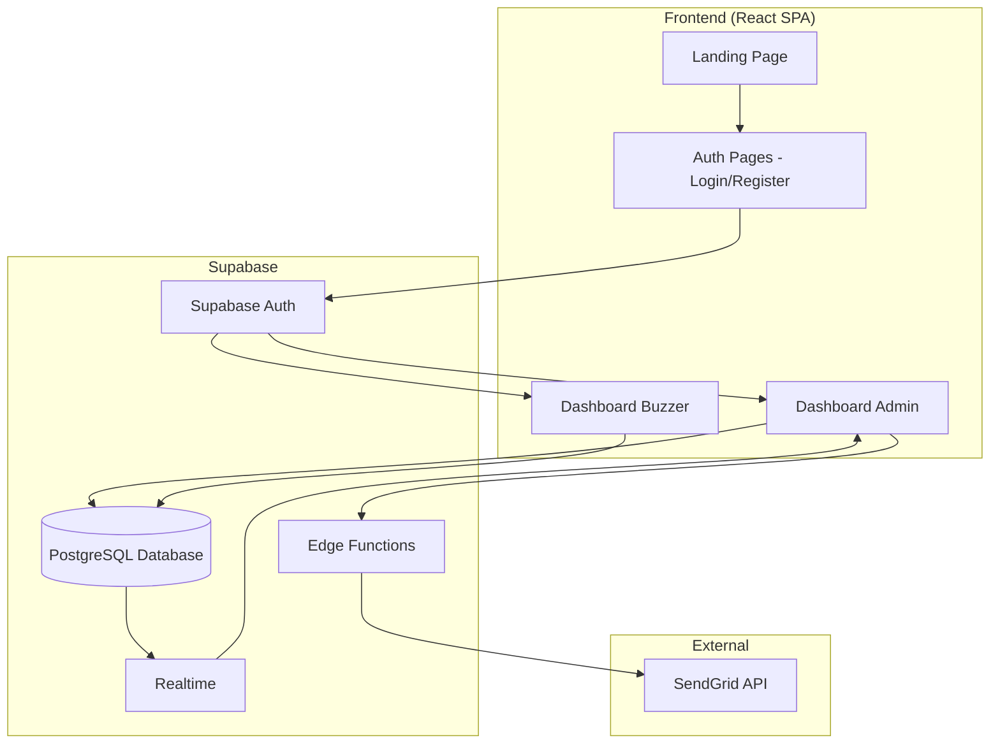
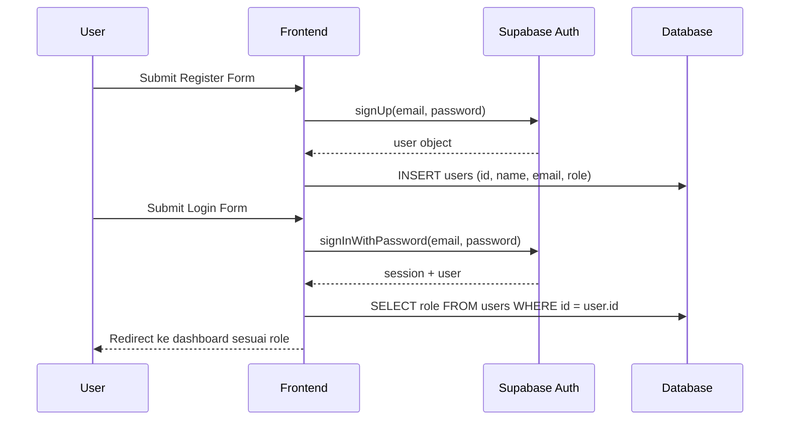
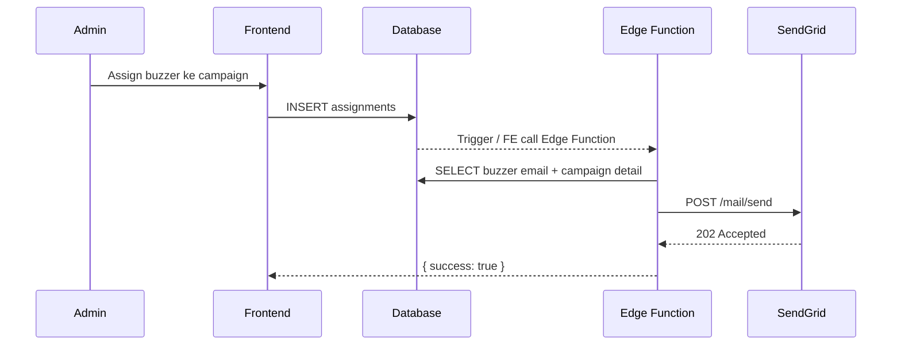

# Design Document — Buzzer Basketball Platform

## Overview

Buzzer Basketball adalah platform manajemen campaign buzzer media sosial berbasis web. Platform ini memiliki dua aktor utama: **Admin** yang membuat dan mengelola campaign, serta **Buzzer** yang menerima penugasan dan mengirimkan bukti posting. Sistem dibangun sebagai Single Page Application (SPA) dengan React.js di frontend dan Supabase sebagai backend-as-a-service.

Alur utama platform:
1. Admin membuat campaign → menugaskan buzzer → sistem mengirim email otomatis
2. Buzzer menerima email → login → melihat brief → submit link posting
3. Admin mereview submission → approve/reject → status terupdate real-time

Stack teknis:
- **Frontend**: React.js + Vite, Tailwind CSS, Framer Motion, React Router v6
- **State Management**: Zustand
- **Backend**: Supabase (Auth, PostgreSQL, Edge Functions, Realtime)
- **Email**: SendGrid via Supabase Edge Function

---

## Architecture



### Routing Structure

```
/                        → Landing Page (public)
/login                   → Login Page (public)
/register                → Register Page (public)
/dashboard/admin         → Dashboard Admin (protected, role: admin)
/dashboard/admin/campaigns/:id  → Campaign Detail (protected, role: admin)
/dashboard/buzzer        → Dashboard Buzzer (protected, role: buzzer)
/dashboard/buzzer/assignments/:id → Assignment Detail (protected, role: buzzer)
```

### Auth Flow



### Assignment + Email Flow



---

## Components and Interfaces

### Frontend Component Tree

```
App
├── Router
│   ├── PublicRoute
│   │   ├── LandingPage
│   │   ├── LoginPage
│   │   └── RegisterPage
│   └── ProtectedRoute (role-aware)
│       ├── AdminLayout
│       │   ├── AdminDashboard
│       │   │   ├── StatsCards
│       │   │   ├── CampaignList
│       │   │   ├── CampaignForm (modal)
│       │   │   └── SubmissionReviewList
│       │   └── CampaignDetail
│       │       ├── AssignmentList
│       │       └── AssignBuzzerModal
│       └── BuzzerLayout
│           ├── BuzzerDashboard
│           │   └── AssignmentCards
│           └── AssignmentDetail
│               ├── BriefSection
│               └── SubmissionForm
```

### Key Component Interfaces

```typescript
// StatsCards
interface StatsData {
  activeCampaigns: number;
  totalAssignments: number;
  activeBuzzers: number;
  approvedSubmissions: number;
}

// CampaignForm
interface CampaignFormProps {
  onSubmit: (data: CampaignInput) => Promise<void>;
  onClose: () => void;
}

// SubmissionForm
interface SubmissionFormProps {
  assignmentId: string;
  campaignId: string;
  buzzerId: string;
  disabled: boolean; // true jika status submitted/approved
  onSubmit: (postLink: string) => Promise<void>;
}

// AssignBuzzerModal
interface AssignBuzzerModalProps {
  campaignId: string;
  alreadyAssigned: string[]; // buzzer_id yang sudah ditugaskan
  onAssign: (buzzerIds: string[]) => Promise<void>;
  onClose: () => void;
}
```

### Supabase Edge Function Interface

```typescript
// POST /functions/v1/send-assignment-email
interface SendEmailRequest {
  assignmentId: string;
  buzzerEmail: string;
  buzzerName: string;
  campaignTitle: string;
  campaignDescription: string;
  campaignDeadline: string;
}

interface SendEmailResponse {
  success: boolean;
  error?: string;
}
```

### Zustand Store Structure

```typescript
// authStore
interface AuthStore {
  user: User | null;
  role: 'admin' | 'buzzer' | null;
  session: Session | null;
  setUser: (user: User, role: string, session: Session) => void;
  clearUser: () => void;
}

// campaignStore
interface CampaignStore {
  campaigns: Campaign[];
  setCampaigns: (campaigns: Campaign[]) => void;
  addCampaign: (campaign: Campaign) => void;
}
```

---

## Data Models

### Database Schema (PostgreSQL via Supabase)

```sql
-- Tabel users (extends Supabase Auth)
CREATE TABLE users (
  id        UUID PRIMARY KEY REFERENCES auth.users(id) ON DELETE CASCADE,
  name      TEXT NOT NULL,
  email     TEXT NOT NULL UNIQUE,
  role      TEXT NOT NULL CHECK (role IN ('admin', 'buzzer')),
  created_at TIMESTAMPTZ DEFAULT NOW()
);

-- Tabel campaigns
CREATE TABLE campaigns (
  id          UUID PRIMARY KEY DEFAULT gen_random_uuid(),
  title       TEXT NOT NULL,
  description TEXT NOT NULL,
  deadline    DATE NOT NULL,
  created_by  UUID NOT NULL REFERENCES users(id) ON DELETE CASCADE,
  created_at  TIMESTAMPTZ DEFAULT NOW()
);

-- Tabel assignments
CREATE TABLE assignments (
  id          UUID PRIMARY KEY DEFAULT gen_random_uuid(),
  campaign_id UUID NOT NULL REFERENCES campaigns(id) ON DELETE CASCADE,
  buzzer_id   UUID NOT NULL REFERENCES users(id) ON DELETE CASCADE,
  status      TEXT NOT NULL DEFAULT 'pending' CHECK (status IN ('pending', 'submitted', 'approved', 'rejected')),
  created_at  TIMESTAMPTZ DEFAULT NOW(),
  UNIQUE (campaign_id, buzzer_id)  -- mencegah duplikasi assignment
);

-- Tabel submissions
CREATE TABLE submissions (
  id          UUID PRIMARY KEY DEFAULT gen_random_uuid(),
  campaign_id UUID NOT NULL REFERENCES campaigns(id) ON DELETE CASCADE,
  buzzer_id   UUID NOT NULL REFERENCES users(id) ON DELETE CASCADE,
  assignment_id UUID NOT NULL REFERENCES assignments(id) ON DELETE CASCADE,
  post_link   TEXT NOT NULL,
  status      TEXT NOT NULL DEFAULT 'pending' CHECK (status IN ('pending', 'approved', 'rejected')),
  submitted_at TIMESTAMPTZ DEFAULT NOW()
);
```

### Row Level Security (RLS) Policies

```sql
-- users: hanya bisa baca data sendiri, admin bisa baca semua
ALTER TABLE users ENABLE ROW LEVEL SECURITY;
CREATE POLICY "users_self_read" ON users FOR SELECT USING (auth.uid() = id);
CREATE POLICY "admin_read_all_users" ON users FOR SELECT USING (
  EXISTS (SELECT 1 FROM users WHERE id = auth.uid() AND role = 'admin')
);

-- campaigns: admin bisa CRUD, buzzer hanya bisa baca campaign yang di-assign
ALTER TABLE campaigns ENABLE ROW LEVEL SECURITY;
CREATE POLICY "admin_manage_campaigns" ON campaigns FOR ALL USING (
  EXISTS (SELECT 1 FROM users WHERE id = auth.uid() AND role = 'admin')
);
CREATE POLICY "buzzer_read_assigned_campaigns" ON campaigns FOR SELECT USING (
  EXISTS (SELECT 1 FROM assignments WHERE campaign_id = campaigns.id AND buzzer_id = auth.uid())
);

-- assignments: admin bisa CRUD, buzzer hanya bisa baca miliknya
ALTER TABLE assignments ENABLE ROW LEVEL SECURITY;
CREATE POLICY "admin_manage_assignments" ON assignments FOR ALL USING (
  EXISTS (SELECT 1 FROM users WHERE id = auth.uid() AND role = 'admin')
);
CREATE POLICY "buzzer_read_own_assignments" ON assignments FOR SELECT USING (buzzer_id = auth.uid());

-- submissions: buzzer bisa insert/read miliknya, admin bisa baca semua dan update status
ALTER TABLE submissions ENABLE ROW LEVEL SECURITY;
CREATE POLICY "buzzer_manage_own_submissions" ON submissions FOR ALL USING (buzzer_id = auth.uid());
CREATE POLICY "admin_manage_submissions" ON submissions FOR ALL USING (
  EXISTS (SELECT 1 FROM users WHERE id = auth.uid() AND role = 'admin')
);
```

### TypeScript Types (Frontend)

```typescript
type Role = 'admin' | 'buzzer';
type AssignmentStatus = 'pending' | 'submitted' | 'approved' | 'rejected';
type SubmissionStatus = 'pending' | 'approved' | 'rejected';

interface User {
  id: string;
  name: string;
  email: string;
  role: Role;
}

interface Campaign {
  id: string;
  title: string;
  description: string;
  deadline: string; // ISO date string
  created_by: string;
  created_at: string;
}

interface Assignment {
  id: string;
  campaign_id: string;
  buzzer_id: string;
  status: AssignmentStatus;
  created_at: string;
  campaign?: Campaign;
  buzzer?: User;
}

interface Submission {
  id: string;
  campaign_id: string;
  buzzer_id: string;
  assignment_id: string;
  post_link: string;
  status: SubmissionStatus;
  submitted_at: string;
}

interface CampaignInput {
  title: string;
  description: string;
  deadline: string;
}
```

---

## Correctness Properties

*A property is a characteristic or behavior that should hold true across all valid executions of a system — essentially, a formal statement about what the system should do. Properties serve as the bridge between human-readable specifications and machine-verifiable correctness guarantees.*

### Property 1: Role-based redirect setelah login

*For any* pengguna yang berhasil login, jika role-nya adalah `admin` maka URL yang dituju harus mengandung `/dashboard/admin`, dan jika role-nya adalah `buzzer` maka URL yang dituju harus mengandung `/dashboard/buzzer`.

**Validates: Requirements 1.3**

---

### Property 2: Redirect ke login jika tidak ada sesi

*For any* route yang dilindungi (protected route), jika tidak ada sesi aktif maka pengguna harus diarahkan ke `/login`.

**Validates: Requirements 1.4**

---

### Property 3: Buzzer tidak bisa akses Dashboard Admin

*For any* pengguna dengan role `buzzer` yang mencoba mengakses path `/dashboard/admin`, sistem harus mengarahkan mereka ke `/dashboard/buzzer`.

**Validates: Requirements 1.5**

---

### Property 4: Campaign form validation

*For any* input form campaign di mana salah satu field wajib (title, description, deadline) kosong atau hanya berisi whitespace, sistem harus menolak pengiriman dan menampilkan pesan validasi.

**Validates: Requirements 2.5**

---

### Property 5: Uniqueness constraint assignment

*For any* pasangan (campaign_id, buzzer_id), sistem hanya boleh menyimpan satu baris di tabel `assignments`. Percobaan duplikasi harus ditolak.

**Validates: Requirements 3.6**

---

### Property 6: Email terkirim setelah assignment dibuat

*For any* assignment baru yang berhasil disimpan ke database, Edge Function harus dipanggil dan email harus dikirimkan ke buzzer yang bersangkutan dalam waktu ≤ 60 detik.

**Validates: Requirements 3.3, 4.1**

---

### Property 7: Email berisi informasi campaign yang benar

*For any* email yang dikirimkan oleh Email_Service, konten email harus mengandung nama buzzer, judul campaign, deskripsi brief, dan deadline yang sesuai dengan data di database.

**Validates: Requirements 4.2, 4.5**

---

### Property 8: Buzzer hanya melihat assignment miliknya

*For any* pengguna dengan role `buzzer` yang login, daftar assignment yang ditampilkan di Dashboard_Buzzer harus hanya berisi assignment dengan `buzzer_id` yang sama dengan `id` pengguna tersebut.

**Validates: Requirements 5.1**

---

### Property 9: Submission URL validation

*For any* input URL pada form submission, jika string kosong atau bukan format URL yang valid, sistem harus menolak pengiriman dan menampilkan pesan validasi.

**Validates: Requirements 6.4**

---

### Property 10: Status assignment terupdate setelah submission

*For any* submission yang berhasil disimpan, status assignment terkait harus berubah menjadi `submitted`.

**Validates: Requirements 6.3**

---

### Property 11: Form submission dinonaktifkan setelah submitted/approved

*For any* assignment dengan status `submitted` atau `approved`, form submission pada Dashboard_Buzzer harus dalam kondisi disabled (tidak bisa diisi atau dikirim).

**Validates: Requirements 6.5**

---

### Property 12: Approve mengupdate status submissions dan assignments

*For any* submission yang di-approve oleh Admin, kolom `status` pada tabel `submissions` harus menjadi `approved` DAN kolom `status` pada tabel `assignments` yang terkait harus menjadi `approved`.

**Validates: Requirements 7.3**

---

### Property 13: Reject mengembalikan assignment ke pending

*For any* submission yang di-reject oleh Admin, kolom `status` pada tabel `submissions` harus menjadi `rejected` DAN kolom `status` pada tabel `assignments` yang terkait harus kembali menjadi `pending`.

**Validates: Requirements 7.4**

---

### Property 14: Statistik admin konsisten dengan data

*For any* state database, nilai statistik yang ditampilkan di Dashboard_Admin (jumlah campaign aktif, total assignment, jumlah buzzer aktif, jumlah submission approved) harus konsisten dengan hasil query langsung ke database.

**Validates: Requirements 10.1**

---

### Property 15: Progress bar konsisten dengan data assignment

*For any* campaign, nilai progress bar yang ditampilkan harus sama dengan `(jumlah assignment approved / total assignment) * 100`.

**Validates: Requirements 10.2**

---

## Error Handling

### Auth Errors

| Kondisi | Penanganan |
|---|---|
| Kredensial login tidak valid | Tampilkan pesan error dari Supabase Auth di bawah form |
| Email sudah terdaftar saat register | Tampilkan pesan "Email sudah digunakan" |
| Sesi expired | Redirect ke `/login` dengan pesan "Sesi Anda telah berakhir" |
| Akses route tanpa sesi | Redirect ke `/login` |

### Campaign & Assignment Errors

| Kondisi | Penanganan |
|---|---|
| Field wajib kosong di form campaign | Tampilkan inline validation message, block submit |
| Duplikasi assignment (campaign + buzzer sama) | Tampilkan toast error "Buzzer sudah ditugaskan ke campaign ini" |
| Gagal menyimpan ke database | Tampilkan toast error, log ke console |

### Email Service Errors

| Kondisi | Penanganan |
|---|---|
| SendGrid API error (4xx/5xx) | Log error ke Supabase Edge Function logs, return `{ success: false, error: message }` |
| Assignment tetap tersimpan meski email gagal | Email failure tidak rollback database transaction |
| Timeout Edge Function | Frontend menampilkan warning "Email mungkin tertunda" |

### Submission Errors

| Kondisi | Penanganan |
|---|---|
| URL kosong | Inline validation: "URL tidak boleh kosong" |
| Format URL tidak valid | Inline validation: "Masukkan URL yang valid (contoh: https://...)" |
| Submit saat form disabled | Tombol submit disabled, tidak ada aksi |

### Global Error Handling

- Semua Supabase query errors ditangkap dengan try/catch dan ditampilkan via toast notification
- Error boundary React untuk mencegah crash seluruh aplikasi
- Loading state pada setiap async operation untuk mencegah double-submit

---

## Testing Strategy

### Unit Testing

Framework: **Vitest** + **React Testing Library**

Fokus unit test:
- Fungsi validasi URL (`isValidUrl`)
- Fungsi validasi form campaign (field kosong/whitespace)
- Komponen `SubmissionForm` — disabled state berdasarkan status
- Komponen `ProtectedRoute` — redirect logic berdasarkan role dan sesi
- Fungsi kalkulasi progress bar (`calculateProgress`)
- Fungsi kalkulasi statistik dashboard (`computeStats`)

Contoh unit test:
```typescript
// isValidUrl
test('menolak string kosong', () => expect(isValidUrl('')).toBe(false));
test('menolak string whitespace', () => expect(isValidUrl('   ')).toBe(false));
test('menerima URL valid', () => expect(isValidUrl('https://instagram.com/p/abc')).toBe(true));

// calculateProgress
test('progress 0 jika tidak ada approved', () => {
  expect(calculateProgress(0, 5)).toBe(0);
});
test('progress 100 jika semua approved', () => {
  expect(calculateProgress(5, 5)).toBe(100);
});
```

### Property-Based Testing

Framework: **fast-check** (JavaScript/TypeScript PBT library)

Konfigurasi: minimum **100 iterasi** per property test.

Setiap property test harus diberi tag komentar dengan format:
`// Feature: buzzer-basketball-platform, Property {N}: {property_text}`

#### Property Tests yang Harus Diimplementasikan

**Property 4 — Campaign form validation:**
```typescript
// Feature: buzzer-basketball-platform, Property 4: Campaign form validation
it('menolak campaign dengan field wajib kosong/whitespace', () => {
  fc.assert(fc.property(
    fc.record({
      title: fc.oneof(fc.constant(''), fc.stringOf(fc.constant(' '))),
      description: fc.string(),
      deadline: fc.string()
    }),
    (input) => {
      const result = validateCampaignForm(input);
      expect(result.valid).toBe(false);
    }
  ), { numRuns: 100 });
});
```

**Property 5 — Uniqueness constraint assignment:**
```typescript
// Feature: buzzer-basketball-platform, Property 5: Uniqueness constraint assignment
it('menolak duplikasi assignment untuk pasangan campaign+buzzer yang sama', () => {
  fc.assert(fc.property(
    fc.uuid(), fc.uuid(),
    async (campaignId, buzzerId) => {
      await insertAssignment(campaignId, buzzerId);
      const result = await insertAssignment(campaignId, buzzerId);
      expect(result.error).not.toBeNull();
    }
  ), { numRuns: 100 });
});
```

**Property 9 — Submission URL validation:**
```typescript
// Feature: buzzer-basketball-platform, Property 9: Submission URL validation
it('menolak URL kosong atau tidak valid', () => {
  fc.assert(fc.property(
    fc.oneof(fc.constant(''), fc.stringOf(fc.constant(' ')), fc.string().filter(s => !s.startsWith('http'))),
    (url) => {
      expect(isValidUrl(url)).toBe(false);
    }
  ), { numRuns: 100 });
});
```

**Property 8 — Buzzer hanya melihat assignment miliknya:**
```typescript
// Feature: buzzer-basketball-platform, Property 8: Buzzer hanya melihat assignment miliknya
it('semua assignment yang dikembalikan memiliki buzzer_id yang sesuai', () => {
  fc.assert(fc.property(
    fc.uuid(),
    async (buzzerId) => {
      const assignments = await fetchAssignmentsForBuzzer(buzzerId);
      assignments.forEach(a => expect(a.buzzer_id).toBe(buzzerId));
    }
  ), { numRuns: 100 });
});
```

**Property 14 & 15 — Statistik konsisten:**
```typescript
// Feature: buzzer-basketball-platform, Property 14 & 15: Statistik konsisten dengan data
it('statistik dashboard konsisten dengan query database', () => {
  fc.assert(fc.property(
    fc.array(fc.record({ status: fc.constantFrom('pending','submitted','approved','rejected') })),
    (assignments) => {
      const stats = computeStats(assignments);
      const approvedCount = assignments.filter(a => a.status === 'approved').length;
      expect(stats.approvedSubmissions).toBe(approvedCount);
    }
  ), { numRuns: 100 });
});
```

### Integration Testing

- Test alur login → redirect ke dashboard yang benar (Requirement 1.3)
- Test alur assign buzzer → email terkirim (mock SendGrid) (Requirement 3.3)
- Test alur submit → status assignment berubah ke `submitted` (Requirement 6.3)
- Test alur approve → status submissions + assignments terupdate (Requirement 7.3)
- Test alur reject → assignment kembali ke `pending` (Requirement 7.4)

### E2E Testing (Opsional)

Framework: **Playwright**

Skenario prioritas:
1. Register sebagai Admin → buat campaign → assign buzzer → verifikasi email terkirim
2. Login sebagai Buzzer → lihat assignment → submit link → verifikasi status berubah
3. Login sebagai Admin → approve submission → verifikasi status terupdate
